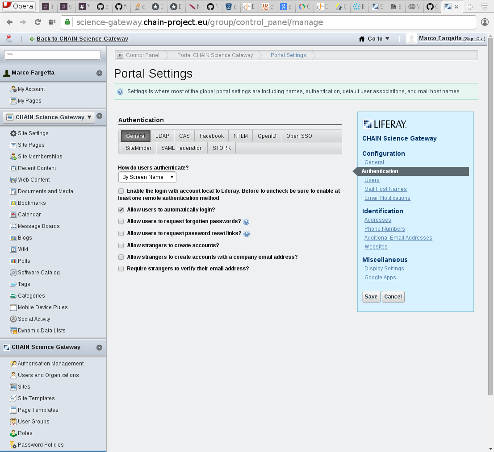

# Federated Login Portlet

## About

The *Federated Login portlet* is an extension plug-in of [Liferay application framework](http://www.liferay.com)
which introduce additional authentication schema to the many already bundled.

Currently, two new schema are supported
* SAML Federation
* STORK Federation (based on STORK 1 protocol)

Other protocols will be added in the future

## Installation

### Requirements

The plug-in work only for Liferay 6.1. It is an ext so after the
installation the source code of liferay is modified and it cannot be
reverted to the original so before to install create a backup of your
current installation.

#### SAML Federation

To perform authentication using SAML, Liferay has to be executed
behind apache (or similar service) configured to perform SAML
authentication. The attributes has to be provided to the application
server in order for the module to read them. A common scenario is to
use apache with [mod_shibboleth](https://shibboleth.net/products/),
which is already available in many linux distribution. Apache will
communicate with the application server using mod_proxy_ajp or other
proxies.

#### STORK federation

The STORK module includes the [opensmal-java
libraries](https://shibboleth.net/products/). In order to make the
library working, please, you have to make available in your application
context the endorsed libraries used by opensaml. These are Xerces and
Xalan. For the installation in your application server you may refer
to the official guideline provided for opensaml. Alternatively a copy
of the libraries are included in the package and they are available
in the path `./federated-login-ext/WEB-INF/ext-lib/portal/endorsed/`
inside the autodeploy directory.

### Deployment

The Federated Login portlet can be deployed in a Liferay instance as any other portlet
copying the war file in the deploy directory or uploading the file using the marketplace
portlet of Liferay and accessing the tab to deploy from war file.

*__NOTE:__ the plug-in will create a portal-ext.properties, if already present
this will be overwritten so if you have some option configured please take note
and apply again after the installation*

### Configuration

#### SAML

No configuration files need to be modified to use SAML federated login. However,
be sure the server performing the SAML communication (i.e. Apache httpd) is properly
configured.

#### STORK

After the installation of the war file you need to stop the server and
locate the file *`SamlEngineSignConfig.xml`* inside the `WEB-INF`
directory of liferay application.  This file contains the information
about the certificate to use with STORK servers. Open the file and
edit the path and other information to refer to a java keystone
containing the certificate and key of the server and the trusted
public keys of remote servers.

For more information on how to prepare the keystone look at STORK
documentation.

### Post Installation Configuration

## Usage

# Support
