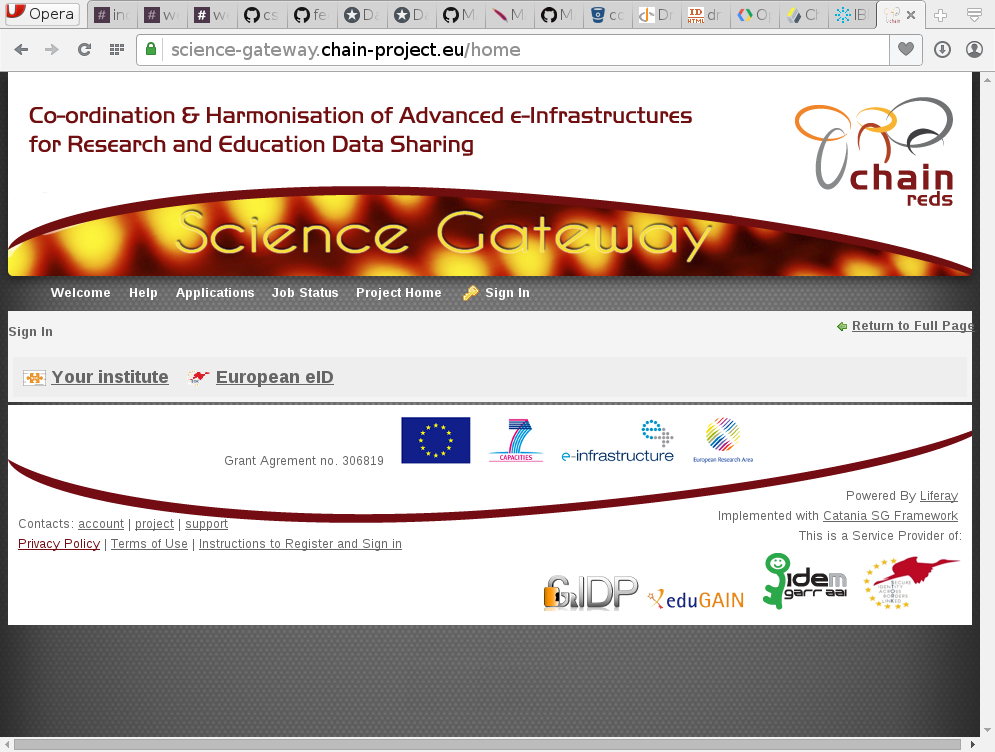

# Federated Login Portlet

## About

The *Federated Login portlet* is an extension plug-in of [Liferay application
framework](http://www.liferay.com) which introduce additional authentication
schema to the many already bundled.

Currently, two new schema are supported
* SAML Federation
* [STORK Federation (based on STORK 1 project)](https://www.eid-stork.eu)

Other protocols will be added in the future

## Installation

### Requirements

The plug-in work only for Liferay 6.1. It is an ext so after the installation
the source code of liferay is modified and it cannot be reverted to the original
so before to install create a backup of your current installation.

#### SAML Federation

To perform authentication using SAML, Liferay has to be executed behind apache
(or similar service) configured to perform SAML authentication. The attributes
has to be provided to the application server in order for the module to read
them. A common scenario is to use apache with
[mod_shibboleth](https://shibboleth.net/products/), which is already available
in many linux distribution. Apache will communicate with the application server
using mod_proxy_ajp or other proxies.

#### STORK federation

The STORK module includes the [opensmal-java
libraries](https://shibboleth.net/products/). In order to make the library
working, please, you have to make available in your application context the
endorsed libraries used by opensaml. These are Xerces and Xalan. For the
installation in your application server you may refer to the official guideline
provided for opensaml. Alternatively a copy of the libraries are included in the
package and they are available in the path
`./federated-login-ext/WEB-INF/ext-lib/portal/endorsed/` inside the autodeploy
directory.

### Deployment

The Federated Login portlet can be deployed in a Liferay instance as any other
portlet copying the war file in the deploy directory or uploading the file using
the marketplace portlet of Liferay and accessing the tab to deploy from war
file.

*__NOTE:__ the plug-in will create a portal-ext.properties, if already present
this will be overwritten so if you have some options configured please take
note and apply again after the installation*

### Configuration

#### SAML

No configuration files need to be modified to use SAML federated login. However,
be sure the server performing the SAML communication (i.e. Apache httpd) is
properly configured.

#### STORK

After the installation of the war file you need to stop the server and locate
the file *`SamlEngineSignConfig.xml`* inside the `WEB-INF` directory of liferay
application.  This file contains the information about the certificate to use
with STORK servers. Open the file and edit the path and other information to
refer to a java keystone containing the certificate and key of the server and
the trusted public keys of remote servers.

For more information on how to prepare the keystone look at STORK documentation.

### Post Installation Configuration

After the installation and configuration of the plug-in several new element
should be visible in the authentication section of portal settings in Liferay
configuration panel.

In the **General** tab there is the new option to disable the local login as
shown in the following figure:

When the option *"Enable the login with account local to Liferay. Before ....."*
is unchecked the login form will not show the username and password fields and
the users have to use an alternative method to use. Other two tabs are
available.

#### SAML

The *SAML federation* tab contains the configuration to use for SAML and it has
the option shown in the following figure:

The first block of parameters, *Authentication Parameters*, allows to define the
mapping among SAML and Liferay attributes. In each field user has to specify the
SAML attribute to use for it. They are not mandatory but the one used to
identify the user is needed.

After, the *Service Parameteres* allows to customise the behaviour of the
authentication. The first combo box, *SAML attribute to identify the user*,
specify how the user has to be identified inside Liferay. *Create account*
check-box when enabled will add a new user when SAML attribute does not identify
any existing user (this feature is not implemented in this version of the
plug-in). The next check-box, *Check LDAP Account*, will search the user inside
the LDAP, if account are managed in a LDAP server, using the query string
provided in the following field. This is useful because Liferay copy locally
only a subset of attributes available so could be useful to search in the larget
set. As an example, Liferay allows only a single mail value per user where LDAP
Account may have multiple values. The filter has to be an LDAP compliant filter
and can include several SAML attributes, from the page help:

>Enter the search filter that will be used to identify the SAML a user. The
>tokens @company_id@, @email_address@, @screen_name@, @last_name@ and
>@first_name@ are replaced at runtime with the correct values. If the IdP
>provides multiple values for some attributes the search will be performed
>several times, corresponding to the number of values obtained

Finally, there are four pages to specify:

* The page where redirect users not registered in the local DB (or LDAP if
  enabled). This page should be customised with a form to request access of
  useful information   on how to be included.

* The page where redirect users in case the Identity Provider is not providing
  mandatory attributes used to identify the user.

* The page to protect with SAML protocol. This page could be modified but the
  same value has to be registered in the file `liferay-web.xml` in your
  deployment.

* The page where users can perform global/local SAML logout after the liferay
  session is destroyed.

#### STORK

The STORK configuration has many similarities with SAML configuration above so
the description will focus on the differences. The configuration tab has the
options shown in the following figure:

The first block of parameters, *Authentication Parameters*, defines the mapping
among Liferay and STORK attributes.

The second block of parameter allows to define the behaviour of STORK.
Differently from SAML, there is not need of an external authentication but
everything is managed in Liferay. Therefore, it is requested to specify the
parameter for the communication with the STORK PEPS service. All these
information should be provided from the organisation manageing the PEPS. The
check-box *European Map* has a graphical impact because it specify if the origin
country of the user has to be selected from a map or from a combo-box.

After the STORK specific configuration there are the option to customise how the
user is identified and if the search is on the local DB or should follow in the
LDAP, using the same filter defined for SAML. Like for the SAML implementation
the option to create new account in case users are not identified is not
implemented in this version.

Finally, the pages for the not identified user and for the authentication
missing mandatory attributes. In this case there is not need to specify the
protected page and the logout page because they are totally managed by Liferay.

## Usage

After the installation and configuration, if everything is working properly, a
user accessing the portal and trying to sign-in should see the Liferay login
portlet with the new protocols, when enabled, shown with an icon and a link,
such as when *OpenID* or *Facebook* authentication are enabled. The following
figures shows the login portlet where both SAML and STORK are enabled and the
local account are disabled (username and password fields are not present):

# Contribution

Many features and protocols are not supported and will be developed if and when
needed. If you would contribute to this project with code, documentation, testing
or other please fork the project and send pull request with your changes.

# Support

There is not formal support for the installation and/or customisation of this
package. Nevertheless, if you have issues or suggestion please
[submit an issue on GitHub](https://github.com/csgf/federated-login-ext/issues).
